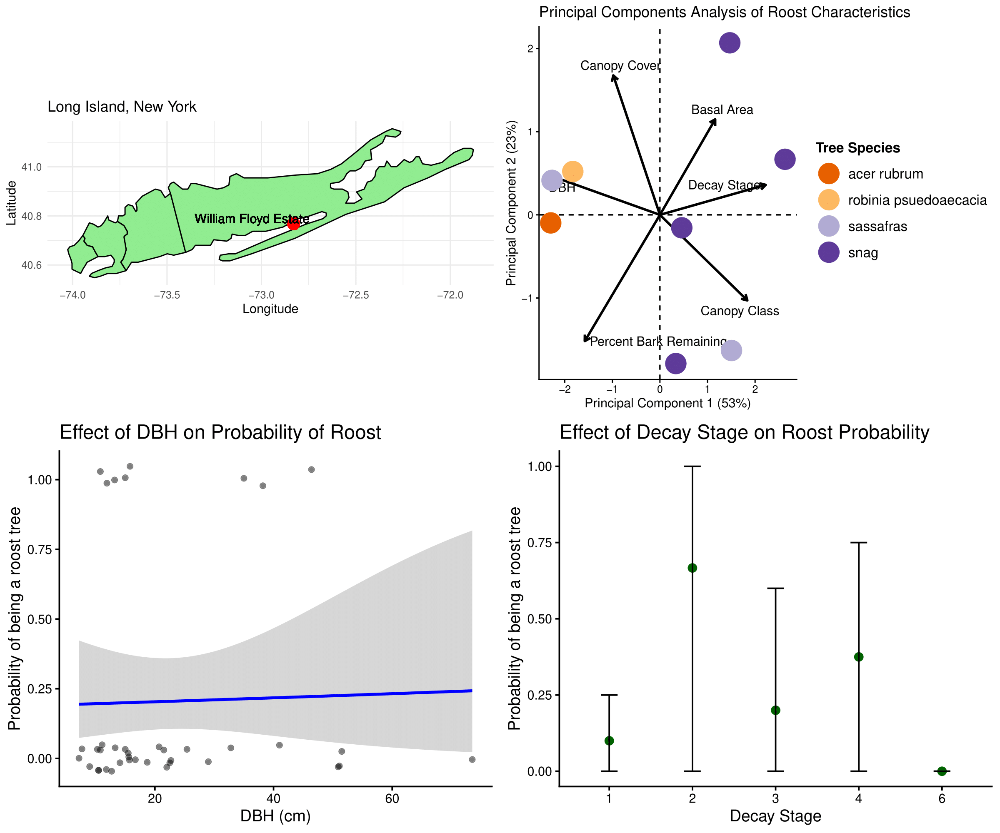

# Introduction

The Northern long-eared myotis (Myotis septentrionalis; MYSE) is a federally endangered bat largely extirpated throughout its Northeast range due to White-Nose Syndrome (WNS), with populations persisting only in coastal environments. Fire Island (FIIS) hosts the only known recently successful northern long-eared bat colony in New York and is one of the few parks in the Northeast region where any MYSE are still observed through 2022. 

add citations from bib! 

# Methods

To summarize variation in day-roost characteristics across tree species, we conducted principal components analysis (PCA) on standardized variables (mean-centered and scaled to unit variance). We interpreted loadings for the first two principal components to identify correlated gradients among DBH and Decay Stage. Site scores from the PCA were used as predictors in subsequent regression models. Analyses were performed in R version 4.4.1 using the stats package.

# Results

Across tree species, DBH and decay stage contributed to 76% of the variance in the data.

Wants in line code injected into results. Reference table and figures

# Discussion

Our results supported previous studies in FIIS. Snags and decayed black locusts are preferred by MYSE. 

# Tables

```{r echo=FALSE}
#| label: SummaryTable
#| tbl-cap: "A summary of the bats captured during mist-netting surveys conducted in 2025."
#| echo: false
if (knitr::is_html_output()) {
  htmltools::includeHTML("../figs/finaltablebatcaptures2025.html")
} else {
  knitr::include_graphics("../figs/finaltablebatcaptures2025.pdf")
}
```

# Figures

```{r}
#| label: FourPanel
#| fig-cap: "Analyses conducted to assess important day roost characteristics"
#| echo: false

```

# References

