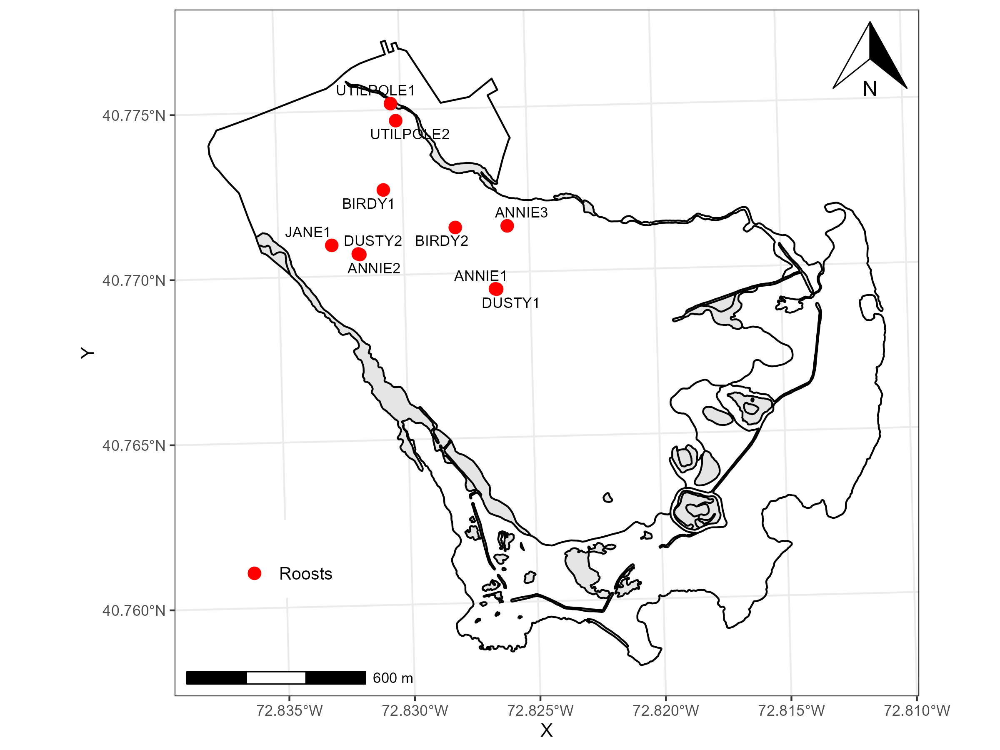
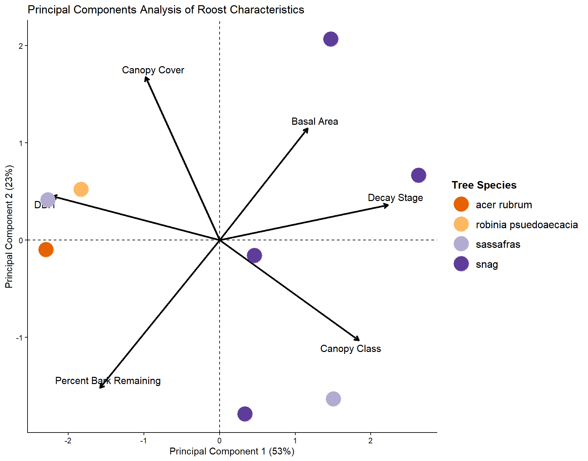

```{r echo=FALSE}
treelatlong <- read.csv("C:/Users/annar/OneDrive/Documents/FIIS/Data/Raw/treedataFIIS2025.csv")

library(tidyverse)

treelatlong <- treelatlong |>
  select(gpspoint, lat, long)

treelatlong <- treelatlong |>
  add_row(gpspoint = 'UTILPOLE1', lat = 40.77519, long = -72.83039) |>
add_row(gpspoint = 'UTILPOLE2', lat = 40.77467, long = -72.83020) #add the utility poles I didn't include in the PCA analysis

treelatlong <- treelatlong |>
  mutate(long = -abs(long))

```

# Introduction

The Northern long-eared myotis (Myotis septentrionalis; MYSE) is a federally endangered bat that has been largely extirpated throughout its Northeastern range due to White-Nose Syndrome (WNS) [@cheng_scope_2021]. Fire Island National Seashore (FIIS) hosts the only recently confirmed MYSE colony in New York and is among the few locations in the Northeast where MYSE are still observed [@gorman_network_2023]. During summer, MYSE form maternity colonies that move among several tree roosts in small family groups, but little is known about their roost preferences. Because post-WNS MYSE detections are rare, land managers lack empirical data on current habitat use so current management plans may no longer reflect the ecological conditions of surviving colonies. 
This study will monitor the remaining MYSE colonies in FIIS to expand understanding of habitat use and support evidence-based management of one of the last known regional populations. 

# Field Methods
We will conduct mist-netting surveys in early May, when MYSE are most likely to be found within the estate. At this point, most reproductive females will likely be in moderate to advanced stages of gestation. Most bat activity at WIFL is predicted to occur between 10 and 30◦C, so nights with temperatures within this range will be especially important [@gorman_bat_2021]. MYSE in WIFL are more active later in the night, indicating later foraging bouts relative to other WIFL bat species. Conducting five-hour surveys starting at dusk will therefore maximize our likelihood of capturing this species. 
We will conduct mist-netting surveys using single, double, and triple high mist-net configurations over water puddles, roads, trails, and forest corridors. We will concentrate efforts where there has been high acoustic activity and at sites where MYSE have previously been captured. Upon capture, demographic data will collected, including bat species, age, sex, reproductive status, presence of ectoparasites, forearm length, and weight. We will attach a radio-transmitter (LB-2X, 0.27 g: Holohil Systems Ltd., Woodlawn, ON, Canada) between the scapulae of MYSE using Perma-Type surgical cement (Perma-Type Company Inc., Plainville, CT, USA). An aluminum alloy band with a unique identification number will be fitted on the forearms of all captured MYSE.
We will use TRX-1000S receivers and folding 3-element Yagi antennas (Wildlife Materials Inc., Carbondale, IL, USA) to locate radio-tagged bats daily for the life of the transmitter or until the transmitter has dropped from the bat. When a roost is located, we will georeference it with handheld GPS units (Garmin International Inc., Olathe, KS, USA). We will then perform an emergence count at dusk to confirm occupancy of the roost by the tagged MYSE as well as to estimate size of colonies. Once a day-roost has been identified, we will record tree species, diameter at breast height (dbh; cm), height, canopy openness (%), decay class, and canopy class. We will determine basal area (BA) of roost tree using a 10-factor prism. Additionally, we will select the 4 closest non-roost trees having a diameter at breast height (DBH) > 10 cm as “pseudo-absences”; for each of these trees we will determine species and measure distance to roost, dbh, decay class, and canopy class.


# Statistical Methods

We will utilize a multi-variate approach to identify tree characteristics that most strongly predict preference by MYSE. We will perform a principal components analysis (PCA) following the approach fully described in [@gorman_characteristics_2022]. As in the original analysis, all continuous variables (e.g., height, dbh, canopy class, basal area, canopy openness, and decay stage) will be standardized prior to analysis. PCA will be conducted by calculating the correlation matrix to identify major gradients in roost-site characteristics and calculating the eigenvalues and eigenvectors of the covariance matrix. Site scores from the PCA were used as predictors in subsequent regression models. Analyses were performed in R version 4.4.1 using the FactoMineR package.

# Results

In the summer of 2025, we captured four pregnant female northern long-eared bats. One individual was later recaptured after giving birth and was lactating; her reproductive status was therefore classified as lactating, the more advanced stage in the maternity season. Overall, we captured 69 bats of four species at the William Floyd Estate: big brown, eastern red, silver-haired, and northern long-eared bats @tbl-summary.

We radio-tagged and tracked four northern long-eared bats for the duration of the transmitter battery life or until we could not detect signal for more than three consecutive days. We identified `r nrow(treelatlong)` day-roosts, eight trees and two utility poles @fig-map. Unidentified snags were the predominated chosen day-roost tree type. 

For the PCA, the first 2 dimensions combined accounted for 76% of variance in roost characteristics, with the first and second components explaining 53% and 23% respectively @fig-PCA. The top contributors of the first dimension were DBH and decay stage, loaded in opposite directions on the plot. The first component, PC1, is plotted on the x-axis. Trees on the right side of the axis have higher decay stages and larger basal area but lower DBH, whereas trees on the left side have higher DBH but lower decay stages. Thus PC1 represents a contrast between highly decayed trees (often snags) and large-diameter but less-decayed trees. 

Principal Component 2 (23%) is defined mainly by canopy cover and percent bark remaining, with canopy cover loading positively and percent bark remaining loading negatively. This axis distinguishes trees in dense-canopy environments (high PC2) from those with greater bark loss and more exposed conditions (low PC2).

# Discussion

Our results indicate  a nonrandom selection, or preference, towards larger live trees in moderate canopy conditions and smaller decayed snags in high density forest stands. These characteristics are likely to offer more high-quality roosting habitat such as cavities and exfoliating bark. Previous studies of William Floyd’s MYSE population demonstrated that MYSE disproportionately selected small, suppressed black locusts (Robinia pseudoacacia) trees or snags for roosting [@gorman_characteristics_2022]. However, these structures are transient. Roost switching may occur because their preferred ephemeral roosts eventually become unsuitable as they continue to deteriorate. In a different study of MYSE roost selection, approximately 25–30% of the identified roost trees fell within 1 year of discovery [@carter_roost_2005]. Having alternative roosts or a high degree of flexibility may be an adaptive strategy for tolerating roost loss [@silvis_day-roost_2015]. 
As such, the successional stage of the forest may be an important factor in shaping landscape use of MYSE. Day-roost selection may not be a function of differences between individual tree species, but by forest successional patterns, stand and tree structure [@silvis_forest_2012]. Roost selection may be driven by a high abundance of individual species rather than differences between species, indicating MYSE’s high degree in plasticity in utilizing local landscapes. Unlike in study areas where black locust presence is the result of anthropogenic industry [@ford_robinia_2006], black locusts in the William Floyd estate occur naturally. Small forested patches on Long Island experience stochastic, stand-replacing events such as hurricanes [@gorman_bat_2021]. These events may cause both individual trees as well as entire forest stands to move in and out of suitability. Existing roosts may become unsuitable while simultaneously promoting regeneration of early-successional species like black locust [@cruz_distribution_2023]. It’s important to assess both the roost tree characteristics as well as the age and successional stage of forest stands utilized by MYSE colonies over time. Maintaining a mosaic of forest types and successional stages may be vital for conserving MYSE.


# Tables

```{r echo=FALSE}
#| label: tbl-summary
#| tbl-cap: "A summary of the bats captured during mist-netting surveys conducted in 2025. Bat species are (Eptesicus fuscus; EPFU), eastern red bats (Lasiurus borealis; LABO), silver-haired bats ((Lasionycteris noctivagans; LANO), and Northern long-eared bats (Myotis septentrionalis; MYSE)."
#| #| out-width: "70%"
#| echo: false
if (knitr::is_html_output()) {
  htmltools::includeHTML("../figs/finaltablebatcaptures2025.html")
} else {
  knitr::include_graphics("../figs/finaltablebatcaptures2025.pdf")
}
```

# Figures
```{r echo=FALSE}
#| label: fig-map
#| fig-cap: "The locations of day roosts used at the William Floyd Estate in 2025. Identified roosts were located in the Northwest region of the estate."
#| echo: false
#| out-width: "70%"

```

```{r echo=FALSE}
#| label: fig-PCA
#| fig-cap: "Principle components 1 and 2 for roosts used by Northern long-eared bats at the William Floyd Estate (2025). Arrow lengths indicate effect size. Direction of the arrow relative to the species indicates a positive or negative relationship. For instance, there is a positive relationship with snag as decay stage and basal area increase."
#| #| out-width: "70%"
#| echo: false

```
\clearpage

# References

